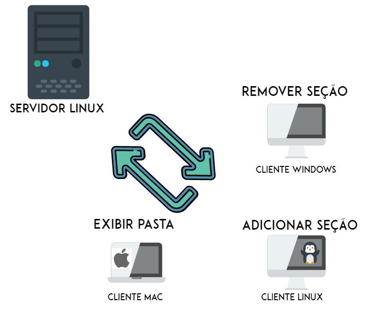

# ICGNU


  Esta ferramenta permite a fácil configuração e navegação do SAMBA atravez de opções que destacam as funcionalidades da aplicação.



## Instalação

  É necessário realizar a execução do Vagrantfile para levantar as     máquinas virtuais. Este arquivo esta pre-configurado para a   instalação do servidor Samba.

  $apt-get install samba

## Interface

**Pastas** - Nesse campo você pode navegar pelas pastas compartilhadas.

**Configurações** - Área destinada apenas para administradores. Nesta opção serão configuradas os parametros das pastas compartilhadas.

**Perfil** - Contem as informações do usuário atualmente logado.


## Serviços

- [Adicionar Seção](adicionar)

- [Remover Seção](#remover)

- [Exibição de Diretorios](#exibir)

### Adicionar Seção

Esse serviço tem a finalidade de adicionar a seção com seus devidos parametros, afim de configurar o servidor Samba.

```
GET /api/smb.php?action=create-share&path=:path&comment=:comment&writeable=:writeable&browseable=:browseable&validUsers=:validUsers
```

Parametros

| Name | Tipo | Descrição |
|-|-|-|
| :path | String | Caminho de recurso no formato de URL |
| :comment | String | Comentarios a respeito da pasta compartilhada |
| :writeable | String | Torna a pasta editavel |
| :browseable | String | Usuários podem navegar dentro das pastas |
| :validUsers | String | Informa os usuários que tem permissão para acessar as pastas |

Exemplo

```
/api/smb.php?action=create-share&path=/home/public&comment=pasta+pública+...&writeable=yes&browseable=yes&users=convidado
```

Em caso de sucesso

```js
{
  "status": "Pasta compartilhada com sucesso."
}
```

Em caso de erro

```js
{
  "status": "parametros invalidos."
}
```

Para executar tal ação é necessário executar o comando:

```
$ cat <<EOF >> /etc/samba/smb.conf
[public]
  path = /home/public
  comment = pasta pública ...
  writeable = yes
  browseable = yes
  valid users = convidado
EOF
sudo service smbd restart
sudo service nmbd restart
```

### Remover Seção

Esse serviço tem a finalidade de remover uma seção.


Parametros

| Name | Tipo | Descrição |
|-|-|-|
| :section | String | Nome da seção que se deseja remover |


Exemplo

```
remSharedFolder($section);
```

Em caso de sucesso

```js
{
  "status": "Compartilhamento removido com sucesso."
}
```

Em caso de erro

```js
{
  "status": "parametros invalidos."
}
```

Para executar tal ação é necessário executar o comando:

```
$smbConfFile = preg_replace($regex, "$3", $smbConfFile);
sudo service smbd restart
sudo service nmbd restart
```

Para validar abra o arquivo `/etc/samba/smb.conf` e verifique se a linha foi adicionada, ou use o `smb-client` para verificar se a pasta está realmente compartilhada.

###