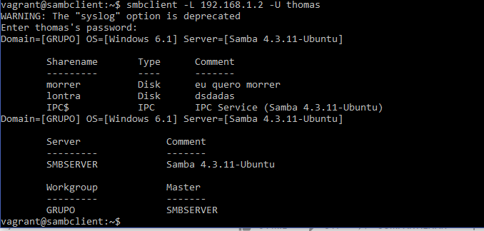

# ICGNU

  Esta ferramenta permite a f�cil configura��o e navega��o do SAMBA atravez de op��es que destacam as funcionalidades da aplica��o.


## Instala��o

  $apt-get install samba

## Screenshots

    

## Interface

**Pastas** - Nesse campo voc� pode navegar pelas pastas compartilhadas.

**Configura��es** - �rea destinada apenas para administradores. Nesta op��o ser�o configuradas os parametros das pastas compartilhadas.

**Perfil** - Contem as informa��es do usu�rio atualmente logado.


## Servi�os

- [Compartilhar Recurso](#compartilhar-recurso)

- [Configura��o do Samba](#configuracao)

- [Exibi��o de Diretorios](#diretorios)

### Compartilhar Recurso

Esse servi�o tem a finalidade...

```
GET /api/smb.php?action=create-share&path=:path&comment=:comment&writeable=:writeable&browseable=:browseable&validUsers=:validUsers
```

Param

| Name | Tipo | Descri��o |
|-|-|-|
| :path | String | Caminho de recurso no formato de URL |
| :comment | String | Comentarios a respeito da pasta compartilhada |
| :writeable | String | Torna a pasta editavel |
| :browseable | String | Usu�rios podem navegar dentro das pastas |
| :validUsers | String | Informa os usu�rios que tem permiss�o para acessar as pastas |

Exemplo

```
/api/smb.php?action=create-share&path=/home/public&comment=pasta+p�blica+...&writeable=yes&browseable=yes&users=convidado
```

Em caso de sucesso

```js
{
  "status": "Pasta compartilhada com sucesso."
}
```

Em caso de erro

```js
{
  "status": "parametros invalidos."
}
```

Para executar tal a��o � necess�rio executar o comando:

```
$ cat <<EOF >> /etc/samba/smb.conf
[public]
  path = /home/public
  comment = pasta p�blica ...
  writeable = yes
  browseable = yes
  valid users = convidado
EOF
sudo service smbd restart
sudo service nmbd restart
```

Para validar abra o arquivo `/etc/samba/smb.conf` e verifique se a linha foi adicionada, ou use o `smb-client` para verificar se a pasta est� realmente compartilhada.

###
